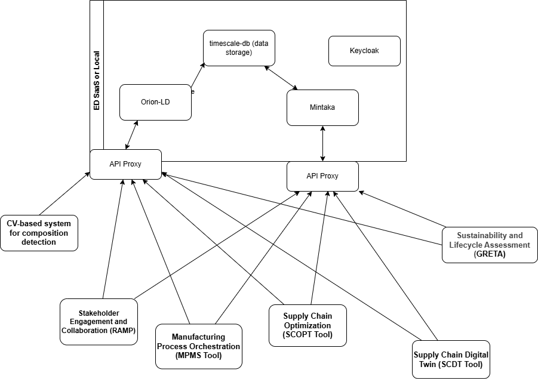
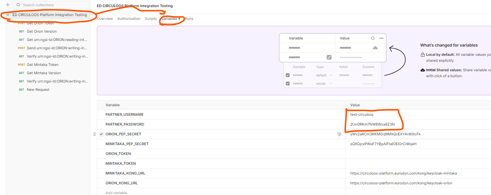

# Integration & Integration Testing Plan for CIRCULOOS

## 1. Executive Summary

This document outlines the Integration and Integration Testing strategy for CIRCULOOS:
- CIRCULOOS Data platform (CDP) ( Orion-LD Context Broker, Mintaka time-series storage, Keycloak authentication) - ED
- Manufacturing Process Orchestration (MPMS) - ED
- Stakeholder Engagement and Collaboration (RAMP)  - ED
- 3D Digital Twin (SCDT) - CUT
- AI-driven Optimization (SCOPT) - CUT
- Sustainability & Lifecycle Assessment Tool (GRETA) - SUPSI
- CV-based Composition Detection (CVTOOL) - CAN

All components communicate via REST APIs using JSON-LD format, following NGSI-LD standards.
The CIRCULOOS Data platform will be used as a database for all data related to the pilots and project. Even if the pilots have internal system, a copy of those data WILL need to be present on the Data platform.

## 2. Integration Architecture Overview

### 2.1 Component Integration Map




## 3 Integration Strategy

### 3.1 Phased Integration Approach

#### Phase 1: Business Components with core Infrastructure (CIRCULOOS data platform)

- Manufacturing Process Orchestration (MPMS)
- Stakeholder Engagement and Collaboration (RAMP)
- 3D Digital Twin (SCDT)
- AI-driven Optimization (SCOPT)
- Sustainability & Lifecycle Assessment Tool (GRETA)
- CV-based Composition Detection (CVTOOL)

#### Phase 2: Intra-Business Components
Circular Supply chain testing
- SCOPT <-> CDP <-> GRETA
- MPMS <-> CDP <-> SCOPT
- CVTOOL <-> CDP <-> MPMS

#### Phase 3: End-to-End Integration 
- Complete workflow testing
- Performance optimization
- Security hardening

### 3.2 Integration Phase 1 with CIRCULOOS data platform

Prior to any interaction with the CIRCULOOS data platform each component needs to get a BEARER token from the CIRCULOOS Keycloak.
Detailed examples can be found in https://github.com/european-dynamics-rnd/circuloos-data-platform/tree/master/commands_URL

|Component                                  |ShortName|
|-------------------------------------------|---------|
|Manufacturing Process Orchestration        |MPMS     |
|Stakeholder Engagement and Collaboration   |RAMP     |
|3D Digital Twin                            |SCDT     |
|AI-driven Optimization                     |SCOPT    |
|Sustainability & Lifecycle Assessment Tool |GRETA    |
|CV-based Composition Detection             |CVTOOL   |


- NGSI-LD Tenant: circuloos_integration
- **⚠️ CRITICAL**: Each component MUST replace `COMPONENT` with their actual ShortName from the table above
- Replace timestamp with the current timestamp when the test is done

#### 3.2.1 Reading from the CIRCULOOS data platform

**⚠️ WARNING: DO NOT use "COMPONENT" or "ORION" in your IDs. You MUST replace it with YOUR component's ShortName (MPMS, RAMP, SCDT, SCOPT, GRETA, or CVTOOL).**

Each component needs to read from the CIRCULOOS data platform the following entity ID pattern:

 ```urn:ngsi-ld:YOUR_SHORTNAME:reading-integration-test-1```

**Examples for each component:**
- MPMS: `urn:ngsi-ld:MPMS:reading-integration-test-1`
- RAMP: `urn:ngsi-ld:RAMP:reading-integration-test-1`

Inside the entity there is a random alphanumeric value for each component. The alphanumeric value will be used in the next step. Save the data received from the data platform as ```reading.json```

**Example response (showing MPMS - replace with YOUR component's ShortName):**
```json 
{
  "id": "urn:ngsi-ld:MPMS:reading-integration-test-1",
  "type": "integration",
  "magic-number": {
    "type": "Property",
    "value": "P5gADFDLM"
  }
}
```

You can utilize the following command [getDataOrionSensorViaKong.sh](https://github.com/european-dynamics-rnd/circuloos-data-platform/blob/master/commands_URL/getDataOrionSensorViaKong.sh) to read/GET the data from the CIRCULOOS Data platform.

Create a file named reading.json with the data received from the data platform and place it on your corresponding folder under verification-phase-1

#### 3.2.2 Providing data to the CIRCULOOS data platform

**⚠️ WARNING: DO NOT use "COMPONENT" or "ORION" in your IDs. You MUST replace it with YOUR component's ShortName.**

Each component needs to send/POST the following entity on the data platform to verify their ability to read/write on the platform. 

**The ID pattern you need to use:**
```urn:ngsi-ld:YOUR_SHORTNAME:writing-integration-test-1```

**Examples for each component:**
- MPMS: `urn:ngsi-ld:MPMS:writing-integration-test-1`
- RAMP: `urn:ngsi-ld:RAMP:writing-integration-test-1`

Save the json-ld that you will provide to the platform as ```writing.json```. 

**IMPORTANT:** 
1. Replace `YOUR_SHORTNAME` in the ID with your actual component ShortName
2. Replace the magic-number with the alphanumeric value received from the previous task
3. Change the observedAt to the current date-time

**Example JSON (showing MPMS - YOU MUST replace MPMS with YOUR component's ShortName):**
```json
{
    "id": "urn:ngsi-ld:MPMS:writing-integration-test-1",
    "type": "integration",
    "magic-number":
    {
      "type": "Property",
      "value": "P5gADFDLM",
      "observedAt": "2026-01-15T09:26:35Z"
    }
}
```

You can utilize  [addDataOrionViaKong.sh](https://github.com/european-dynamics-rnd/circuloos-data-platform/blob/master/commands_URL/addDataOrionViaKong.sh) to send/POST data to the CIRCULOOS Data platform.


#### 3.2.3 Reading historical data from the CIRCULOOS data platform

**⚠️ WARNING: Replace YOUR_SHORTNAME with your actual component ShortName (MPMS, RAMP, SCDT, SCOPT, GRETA, or CVTOOL).**

Each component needs to read the historical (Mintaka) data from the platform. 

**The ID pattern you need to use:**
```urn:ngsi-ld:YOUR_SHORTNAME:writing-integration-test-1```

**Examples:**
- MPMS: `urn:ngsi-ld:MPMS:writing-integration-test-1`
- RAMP: `urn:ngsi-ld:RAMP:writing-integration-test-1`
- etc.

Save the response in a file called ```historical-data.json```

Create a file named writing.json with the data to be sent to the data platform and place it on your corresponding folder under verification-phase-1 folder. Next generate a pull request from both reading.json, writing.json and historical-data.json files.Please use your ShortName as the name of your branch. An tutorial from the internet to create a [pull request](https://opensource.com/article/19/7/create-pull-request-github).

See also under the folder verification-phase-1/example for an example. 

#### 3.2.4 Postman

Also there is a [Postman collection](./verification-phase-1/example/ED%20CIRCULOOS%20Platform%20Integration%20Testing.postman_collection.json). See the variables to change the **PARTNER_USERNAME** and **PARTNER_PASSWORD**



## 3.3 Open calls

**⚠️ CRITICAL FOR OPEN CALLS: You MUST use YOUR actual PARTNER_USERNAME, NOT the example "circuloos-european_dynamics"!**

All the open calls will need to be able to read/write (GET/PUSH) to the data platform. 

**IMPORTANT:** Replace `YOUR_PARTNER_USERNAME` in the ID patterns below with your actual PARTNER_USERNAME provided to you.

**ID patterns to use:**
- Reading: `urn:ngsi-ld:YOUR_PARTNER_USERNAME:reading-integration-test-1`
- Writing: `urn:ngsi-ld:YOUR_PARTNER_USERNAME:writing-integration-test-1`

**Example ONLY (DO NOT copy this exact ID):**  
If your PARTNER_USERNAME is `circuloos-european_dynamics`, then your reading ID would be:  
```urn:ngsi-ld:circuloos-european_dynamics:reading-integration-test-1```

**Another example:**  
If your PARTNER_USERNAME is `circuloos-my_organization`, then your reading ID would be:  
```urn:ngsi-ld:circuloos-my_organization:reading-integration-test-1```

Check [3.2](#32-integration-phase-1-with-circuloos-data-platform), [3.2.1](#321-reading-from-the-circuloos-data-platform), [3.2.2](#322-providing-data-to-the-circuloos-data-platform) and [3.2.4](#324-postman) for detailed instructions.

**Deliverables:**
- You will **NOT** need to upload anything to GitHub (so **DO NOT** create a PULL request)
- You **MUST** include relevant screenshots in your specific deliverable
- **Remember to remove/hide your PARTNER_PASSWORD from any screenshot** for security


## 4. Issue Tracking and Resolution

### 4.1 Issue Management Process

All integration issues will be tracked using GitHub Issues in the project repository. The workflow follows these steps:

#### 4.1.1 Issue Creation
1. **Identify the Issue**: During integration testing, when an issue is discovered, create a new GitHub Issue immediately
2. **Use Labels**: Apply appropriate labels:
   - `integration` - For all integration-related issues
   - `bug` - For defects or errors
   - `enhancement` - For improvement requests
   - `documentation` - For documentation issues
   - `critical` / `high` / `medium` / `low` - For priority levels
   - Component labels: `MPMS`, `RAMP`, `SCDT`, `SCOPT`, `GRETA`, `CVTOOL`, `data-platform`
3. **Assign Responsibility**: Assign to the partner responsible for the affected component
4. **Set Milestone**: Link to the appropriate project phase milestone

#### 4.1.2 Issue Tracking Workflow
1. **Open** - Issue created and awaiting triage
2. **In Progress** - Partner is actively working on the issue
3. **Testing** - Fix implemented and ready for verification
4. **Closed** - Issue resolved and verified

#### 4.1.3 Communication Protocol
- All technical discussion happens in GitHub Issue comments
- Tag relevant partners using `@username` mentions
- For urgent issues, notify via project communication channels (email/Slack) with GitHub Issue link
- Update issue status within 2 business days of assignment
- All partners must monitor issues labeled with their component name

### 4.2 Escalation Procedures

#### 4.2.1 Escalation Levels

**Level 1: Component Level** (Days 1-3)
- Issue assigned to component owner partner
- Technical team investigates and resolves
- Expected resolution: 3 business days

**Level 2: Technical Coordination** (Days 4-7)
- If unresolved after 3 days, escalate to technical coordinator (ED)
- Multi-partner coordination meeting scheduled if needed
- Expected resolution: 7 business days total

**Level 3: Project Management** (Days 8+)
- If unresolved after 7 days or if it impacts project deliverables
- Escalate to Project Management Team
- Impact assessment on project timeline and deliverables
- Risk mitigation plan created

#### 4.2.2 Critical Issue Fast-Track
For **critical** issues (system down, data loss, security breach):
- Immediate notification to all partners via email and project channels
- Label with `critical` tag
- Technical coordinator involved from start
- Daily status updates required
- Expected resolution: 24-48 hours

#### 4.2.3 Cross-Component Issues
When issues involve multiple components:
1. Create a parent issue with all affected component labels
2. Create linked child issues for each component if needed
3. Technical coordinator facilitates resolution meeting
4. Document dependencies and integration points in issue description

#### 4.2.4 Issue Tracking Template
```markdown
## Issue Details
- **Issue ID**: INT-XXX
- **Component(s)**: [Component names]
- **Severity**: Critical/Major/Minor
- **Test Case**: [Test ID]

## Description
[Detailed description of the issue]

## Steps to Reproduce
1. [Step 1]
2. [Step 2]

## Expected vs Actual
- **Expected**: [Expected behavior]
- **Actual**: [Actual behavior]

## Environment
- **Version**: [Component versions]
- **Test Data**: [Data set used]

## Logs/Screenshots
[Attach relevant logs or screenshots]
```